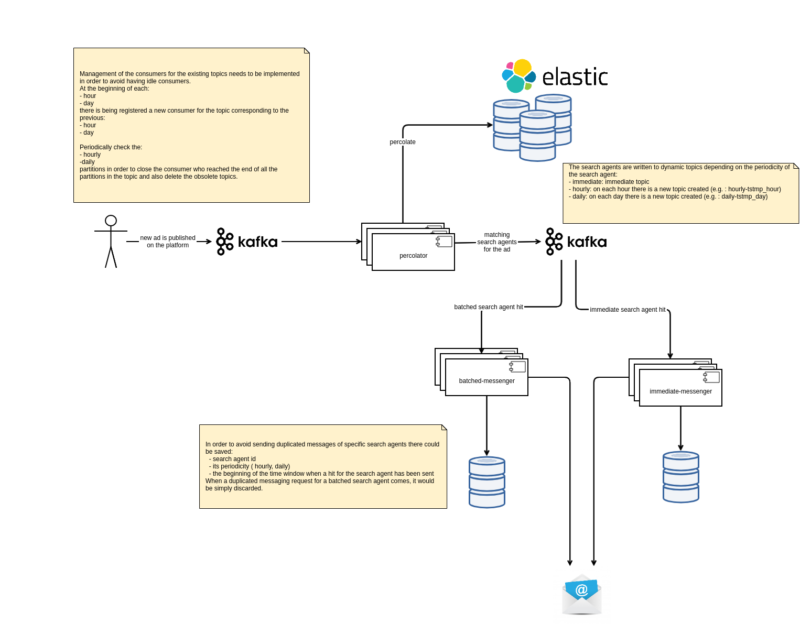

Search alert 
============

This is a proof of concept project on implementing both:

- near real time (NRT)
- batched (hourly/daily)

search alert functionality.

## Introduction

A search alert is as [Google Alerts](https://www.google.com/alerts) puts it a way to :

> Monitor the web for interesting new content 

When having a search index at disposal, at the time new content is being indexed, the system
can checked whether it fits to any of the search alerts configured and if so
notify the user about it.

This system is no match for the scale of the 
[Google Alerts](https://www.google.com/alerts) system, but it is rather a
proof of concept on how this functionality can be achieved in a decent fashion
for websites of medium size.

In the same fashion as Google Alerts, this system should be able to handle both:

- immediate (as it happens)
- batched (hourly, daily, weekly)

search alert notifications.

## Technological stack

The tech stack on which the system behind this project is built is composed of the following components:

- [Apache Kafka](https://kafka.apache.org/) for streaming data between the components of the system
- [Elasticsearch](https://www.elastic.co/elasticsearch/) distributed, RESTful search engine 
- [Apache Cassandra](https://cassandra.apache.org/) for storing information about the search alert messages sent
in order to avoid sending duplicated messages (e.g.: for a batched search alert on a specific hour/day).

## Architecture

The architecture of this proof of concept system is relatively simple:

For the sake of better understanding the purpose of this system we'll consider that this
system handles the search alert functionality for a news website.
The users of the website that have interest for a certain topic 
can register a search alert to be notified when new articles matching their criteria 
are published on the platform. 
In case of having matches, the search alerts can be configured by the users to be notified
immediately/ hourly/ daily about new results. 

When a news article is being published on the news platform, it will also be checked against the registered
search alerts to look for matches.

There is a different type of handling between the immediate, and the batched search alerts.

### Immediate search alerts

The immediate search alerts that match a newly published article are going to be pushed by the _percolator_ 
component to the `immediate` topic which is being handled almost on the spot by the 
_immediate-messenger_ component to notify the user about a new possible match.

The _immediate-messenger_ component runs indefinitely.

### Batched search alerts

The batched  search alert notifications need to be _"parked"_ until their corresponding messaging period(hour/day) elapses.

Considering that a search alert is configured to hourly notify a user about new articles matching a specific
search criteria, when an article is being published on  `2020-06-19 09:21:05` on the marketplace platform,
the search alert should then notify the user at `2020-06-19 10:00:00`. In this case, the search alert 
information is going to be pushed to the topic `hourly_1592553600000` (`1592553600000` corresponds 
to `2020-06-19 10:00:00`).
In case that the search alert would have been configured to delivery notifications daily, then
the search alert information would be then published to the topic `daily_1592604000000` (`1592604000000` 
corresponds to `2020-06-20 00:00:00`)

The consumption of the entries from the `hourly_1592553600000` topic will start at the earliest 
at `2020-06-19 10:00:00`.
The consumption of the entries from the `daily_1592604000000` topic will start at the earliest
at `2020-06-20 00:00:00`.

The _batched-messenger_ component is responsible of handling the batched
search alert hits from a specified topic that contain entries for the hourly/daily search alerts.
The consumption from the topic corresponding to a specific hour/day time window will begin only 
after the time window has elapsed.  
Once the consumption of these topics reaches the end of the topic, the _batched-messenger_ component
can end its runtime.

Once all the partitions of the topic `hourly_1592553600000` are read by the _batched-messenger_ component,
the batched topic is considered obsolete (and can be eventually be deleted) and not being taken 
anymore into consideration for consumption.

 **OPTIONAL** In case of finding a matching article for a batched search alert, the _percolator_ component is responsible to _"pause"_ 
 the search alert until its current batching period (hour/day) elapses in order to avoid doing unnecessary matches
 against new incoming articles.

#### Orchestrating the batched search alerts

As mentioned previously, the batched  search alert notifications need to be _"parked"_ until their corresponding 
messaging period(hour/day) elapses.

At the beginning of each batched time window (hour/day) should be therefor started one or multiple instances
of the _batched-messenger_ component for the batched topics on which the consumer offset of the  _batched-messenger_
lags behind.

Depending on the amount of the batched search alert hits from the topic that need to be processed, the
orchestrator could then choose how many instances of the _batched-messenger_ component to spawn.
